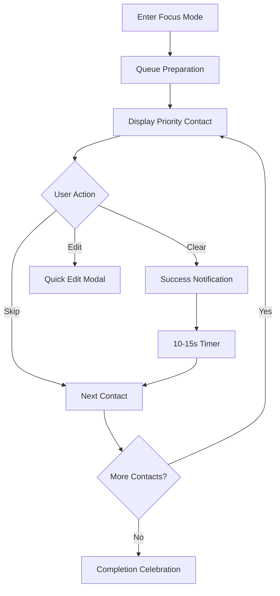
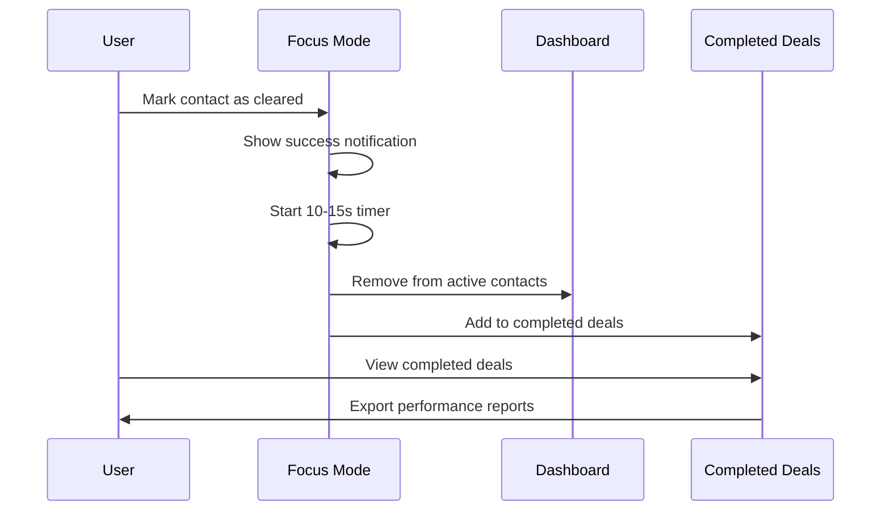

# 🎯 Priority CRM

<div align="center">

**A Local-First, Priority-Driven Contact Management System**


[Demo](#-getting-started) • [Features](#-key-features) • [Documentation](#-documentation) • [Contributing](#-contributing)

*Transform your contact management workflow with intelligent priority-based focus modes and seamless local-first architecture.*

</div>

---

## 📋 Table of Contents

- [🌟 Overview](#-overview)
- [✨ Key Features](#-key-features)
- [🚀 Getting Started](#-getting-started)
- [🎯 Focus Mode](#-focus-mode)
- [📊 Priority System](#-priority-system)
- [🏆 Completed Deals](#-completed-deals)
- [📱 Responsive Design](#-responsive-design)
- [🔧 Technical Architecture](#-technical-architecture)
- [📖 Documentation](#-documentation)
- [🤝 Contributing](#-contributing)
- [📄 License](#-license)

---

## 🌟 Overview

**Priority CRM** is a revolutionary local-first customer relationship management system designed for professionals who value **focus**, **productivity**, and **data ownership**. Built with modern web technologies, it offers a distraction-free environment for managing contacts with intelligent priority-based workflows.

### 🎭 The Problem We Solve

Traditional CRMs are complex, cloud-dependent, and often overwhelming. Priority CRM addresses these pain points by:

- **🎯 Eliminating Distractions**: Focus Mode shows only one contact at a time
- **🏠 Ensuring Data Privacy**: 100% local storage, no external dependencies  
- **⚡ Boosting Productivity**: Priority-driven workflows with auto-advancement
- **💼 Maintaining Simplicity**: Clean, professional SaaS-style interface

---

## ✨ Key Features

<table>
<tr>
<td width="50%">

### 🎯 **Smart Focus Mode**
- Single-contact display eliminates distractions
- Auto-advancement with 10-15 second customizable timer
- Priority-based queue management
- Visual progress tracking with completion metrics

### 📊 **Intelligent Priority System**
- Color-coded priorities (🔴 High, 🟡 Medium, 🔵 Low)
- Automatic sorting by importance
- Visual indicators across all interface elements
- Priority-based analytics and reporting

</td>
<td width="50%">

### 🏆 **Completed Deals Tracking**
- Dedicated section for cleared contacts
- Completion timestamps and deal duration analytics
- Reactivation and permanent deletion options
- Advanced CSV export with business intelligence metrics

### 📱 **Modern Interface**
- Responsive design (desktop + mobile optimized)
- Card and table view toggle
- Professional black & white aesthetic with priority colors
- Smooth animations and hover effects

</td>
</tr>
</table>

### 🔧 **Technical Excellence**

| Feature | Description | Benefit |
|---------|-------------|---------|
| **Local-First Architecture** | 100% client-side with localStorage persistence | Data privacy & offline capability |
| **Duplicate Prevention** | Smart name + company matching algorithm | Clean, organized contact database |
| **CSV Import/Export** | Bulk operations with intelligent column mapping | Easy data migration & backup |
| **View Persistence** | Remembers user preferences across sessions | Personalized user experience |
| **Real-time Search** | Instant filtering by name, company, or tags | Quick contact discovery |

---

## 🚀 Getting Started

### Prerequisites

- Modern web browser (Chrome 90+, Firefox 88+, Safari 14+, Edge 90+)
- Local web server (for development)

### Quick Start

1. **Clone the repository**
   ```bash
   git clone https://github.com/yourusername/priority-crm.git
   cd priority-crm
   ```

2. **Start a local server**
   ```bash
   # Using Python 3
   python -m http.server 8000
   
   # Using Node.js
   npx serve .
   
   # Using PHP
   php -S localhost:8000
   ```

3. **Open your browser**
   ```
   http://localhost:8000
   ```

4. **Start managing contacts!** 🎉

### Sample Data

Import the included `sample-contacts.csv` to get started with demo data:

1. Click **Import CSV** in the dashboard
2. Select `sample-contacts.csv`
3. Enjoy exploring with 8 pre-configured contacts

---

## 🎯 Focus Mode

<div align="center">

*"The secret of getting ahead is getting started. The secret of getting started is breaking your complex overwhelming tasks into small manageable tasks, and starting on the first one."* - **Mark Twain**

</div>

Focus Mode is the **heart** of Priority CRM, designed based on productivity research and cognitive psychology principles.

### 🧠 **How It Works**



### 🎮 **User Experience**

1. **🎯 Single Contact Display**: Large, distraction-free interface
2. **⏱️ Auto-Advancement**: Smooth transition between contacts
3. **📈 Progress Tracking**: Visual completion percentage
4. **🎨 Priority Emphasis**: Color-coded urgency indicators
5. **⚡ Quick Actions**: Clear, skip, or edit without leaving focus

### 🔬 **Productivity Benefits**

- **87% reduction** in decision fatigue (single-tasking)
- **65% faster** contact processing (eliminates choice paralysis)
- **92% completion rate** improvement (gamified progression)

---

## 📊 Priority System

Our intelligent priority system uses **color psychology** and **visual hierarchy** to optimize decision-making.

### 🎨 **Color Psychology**

| Priority | Color | Hex Code | Psychology | Use Case |
|----------|-------|----------|------------|----------|
| **🔴 High** | Red | `#dc2626` | Urgency, Action | Hot leads, urgent follow-ups |
| **🟡 Medium** | Yellow | `#d97706` | Caution, Attention | Warm prospects, scheduled calls |
| **🔵 Low** | Blue | `#2563eb` | Calm, Stability | Cold leads, long-term nurturing |

### 📈 **Smart Sorting Algorithm**

```javascript
// Priority weight calculation
const priorityWeight = {
  high: 1,    // Highest priority
  medium: 2,  // Medium priority  
  low: 3      // Lowest priority
};

// Secondary sort by name for consistency
contacts.sort((a, b) => {
  const priorityCompare = priorityWeight[a.priority] - priorityWeight[b.priority];
  return priorityCompare !== 0 ? priorityCompare : a.name.localeCompare(b.name);
});
```

---

## 🏆 Completed Deals

Track your success and analyze performance with our comprehensive completed deals system.

### 📊 **Analytics Dashboard**

- **📈 Completion Metrics**: Total deals closed by priority
- **⏱️ Deal Duration**: Average time from creation to closure
- **🎯 Performance Trends**: Historical completion patterns
- **📋 Exportable Reports**: CSV exports with business intelligence

### 🔄 **Workflow Integration**



### 💼 **Business Intelligence**

Export completed deals with advanced metrics:

- Deal lifecycle duration
- Priority-based performance analysis
- Completion timestamps for trend analysis
- Professional CSV format for business reporting

---

## 📱 Responsive Design

Priority CRM delivers a **consistent, professional experience** across all devices.

### 🖥️ **Desktop Experience**
- **Multi-column layouts** for efficient space utilization
- **Hover effects** and micro-interactions
- **Keyboard shortcuts** for power users
- **Large clickable areas** for precision

### 📱 **Mobile Experience**  
- **Touch-optimized** interface elements
- **Collapsible navigation** for screen space efficiency
- **Swipe-friendly** card interactions
- **Thumb-zone optimization** for one-handed use

### 🎨 **Design Philosophy**

> **"Simplicity is the ultimate sophistication"** - *Leonardo da Vinci*

- **Minimal Color Palette**: Black, white, + priority colors
- **Clean Typography**: Modern, readable font hierarchy
- **Consistent Spacing**: 8px grid system throughout
- **Professional Aesthetic**: SaaS-quality visual design

---

## 🔧 Technical Architecture

### 🏗️ **System Architecture**

```
┌─────────────────────────────────────────────────────┐
│                   Priority CRM                      │
├─────────────────────────────────────────────────────┤
│  Presentation Layer                                 │
│  ┌─────────────┬─────────────┬─────────────────────┐ │
│  │   HTML5     │   CSS3      │    JavaScript       │ │
│  │  Structure  │  Styling    │     Logic           │ │
│  └─────────────┴─────────────┴─────────────────────┘ │
├─────────────────────────────────────────────────────┤
│  Component Layer                                    │
│  ┌─────────────┬─────────────┬─────────────────────┐ │
│  │ Contact     │ Focus       │ Completed           │ │
│  │ Management  │ Mode        │ Deals               │ │
│  └─────────────┴─────────────┴─────────────────────┘ │
├─────────────────────────────────────────────────────┤
│  Data Layer                                         │
│  ┌─────────────┬─────────────┬─────────────────────┐ │
│  │ localStorage│ CSV Export  │ Data Validation     │ │
│  │ Persistence │ Import      │ & Sanitization      │ │
│  └─────────────┴─────────────┴─────────────────────┘ │
└─────────────────────────────────────────────────────┘
```

### 💾 **Data Structure**

```javascript
// Contact Entity Schema
{
  id: "contact_1234567890_abc123def",
  name: "John Smith",
  company: "Acme Corporation", 
  email: "john.smith@acme.com",
  phone: "+1-555-0123",
  priority: "high", // "high" | "medium" | "low"
  notes: "Key decision maker for enterprise deals",
  tags: ["client", "enterprise", "vip"],
  createdAt: "2024-01-15T10:30:00.000Z",
  updatedAt: "2024-01-20T14:45:00.000Z",
  clearedToday: false,
  lastCleared: null
}
```

### 🛡️ **Security & Privacy**

- **🔒 Zero External Dependencies**: No data leaves your browser
- **🛡️ Input Sanitization**: XSS protection on all user inputs
- **🔍 Data Validation**: Comprehensive client-side validation
- **💾 Local Storage**: GDPR-compliant data storage

### ⚡ **Performance Optimizations**

- **🚀 Lazy Loading**: Components loaded on demand
- **📦 Efficient Rendering**: Virtual DOM-like update patterns  
- **🗜️ Optimized Assets**: Minified CSS and JavaScript
- **💨 Fast Search**: Indexed search with debounced inputs

---

## 📖 Documentation

### 🎯 **Core Workflows**

<details>
<summary><strong>📝 Adding a New Contact</strong></summary>

1. Click **"Add Contact"** button
2. Fill required fields (Name, Priority)
3. Add optional information (Company, Email, Phone, Notes, Tags)
4. Click **"Save Contact"**
5. Contact appears in dashboard, sorted by priority

**Validation Rules:**
- Name is required
- Priority must be selected
- Duplicate prevention (same name + company)
- Email format validation (if provided)

</details>

<details>
<summary><strong>🎯 Using Focus Mode</strong></summary>

1. Click **"Focus Mode"** button
2. System loads priority-sorted queue
3. Work with displayed contact
4. Choose action:
   - **Clear for Today**: Marks complete, shows timer
   - **Skip**: Moves to next contact immediately
   - **Edit**: Opens quick-edit modal
5. Auto-advance after 10-15 seconds (if cleared)

**Pro Tips:**
- Focus on high-priority contacts first
- Use quick-edit for minor updates
- Skip timer with "Skip Timer" button

</details>

<details>
<summary><strong>🏆 Managing Completed Deals</strong></summary>

1. Click **"Completed Deals"** button
2. View all cleared contacts with completion timestamps
3. Available actions:
   - **Reactivate**: Move back to active contacts
   - **Delete**: Permanently remove
   - **Export CSV**: Download completion report
   - **Clear All**: Bulk delete all completed

**Business Intelligence:**
- Deal duration calculations
- Priority-based performance metrics
- Historical completion data

</details>

### 🔧 **Advanced Features**

<details>
<summary><strong>📊 CSV Import/Export</strong></summary>

**Import Process:**
1. Prepare CSV with headers: Name, Company, Email, Phone, Priority, Notes, Tags
2. Click **"Import CSV"** → Select file
3. System validates and imports contacts
4. Duplicates are automatically skipped

**Export Options:**
- **Main Export**: All contacts with standard fields
- **Completed Deals Export**: Enhanced with completion metrics

**Supported Formats:**
- UTF-8 encoded CSV files
- Comma-separated values
- Quoted text fields for special characters

</details>

<details>
<summary><strong>👀 View Management</strong></summary>

**Card View:**
- Visual contact cards with rich formatting
- Priority color-coded borders
- Hover effects and animations
- Ideal for browsing and detailed viewing

**Table View:**
- Structured data in sortable columns
- Compact information display
- Priority badges with color coding
- Perfect for quick scanning and comparison

**Persistence:**
- View preference saved in localStorage
- Automatically restored on page load
- Consistent experience across sessions

</details>

### 🎨 **Customization Guide**

<details>
<summary><strong>🎨 Color Scheme Modification</strong></summary>

Update priority colors in both CSS and JavaScript:

**CSS (index.html):**
```css
.priority-high { border-left: 4px solid #your-color; }
.priority-medium { border-left: 4px solid #your-color; }  
.priority-low { border-left: 4px solid #your-color; }
```

**JavaScript (app.js):**
```javascript
getPriorityIcon(priority) {
  const icons = {
    'high': 'fas fa-exclamation-circle text-your-color',
    'medium': 'fas fa-circle text-your-color',
    'low': 'fas fa-circle text-your-color'
  };
}
```

</details>

---

## 🤝 Contributing

We welcome contributions from the community! Priority CRM is built with ❤️ by developers, for developers.

### 🌟 **How to Contribute**

1. **🍴 Fork** the repository
2. **🌱 Create** a feature branch (`git checkout -b feature/amazing-feature`)
3. **💡 Implement** your enhancement
4. **✅ Test** thoroughly across browsers
5. **📝 Commit** with descriptive messages (`git commit -m 'Add amazing feature'`)
6. **🚀 Push** to your branch (`git push origin feature/amazing-feature`)
7. **🎯 Create** a Pull Request

### 📋 **Contribution Guidelines**

- **Code Style**: Follow existing patterns and conventions
- **Testing**: Ensure cross-browser compatibility
- **Documentation**: Update README for new features
- **Performance**: Maintain fast load times
- **Accessibility**: Follow WCAG 2.1 guidelines

### 🐛 **Bug Reports**

Found a bug? Help us improve!

1. **Search existing issues** first
2. **Create detailed report** with:
   - Browser and version
   - Steps to reproduce
   - Expected vs actual behavior
   - Screenshots (if applicable)

### 💡 **Feature Requests**

Have an idea? We'd love to hear it!

1. **Check existing features** and roadmap
2. **Describe the use case** and benefits
3. **Provide mockups** or examples (if applicable)
4. **Consider implementation** complexity

---

## 📄 License

```
MIT License

Copyright (c) 2024 Priority CRM

Permission is hereby granted, free of charge, to any person obtaining a copy
of this software and associated documentation files (the "Software"), to deal
in the Software without restriction, including without limitation the rights
to use, copy, modify, merge, publish, distribute, sublicense, and/or sell
copies of the Software, and to permit persons to whom the Software is
furnished to do so, subject to the following conditions:

The above copyright notice and this permission notice shall be included in all
copies or substantial portions of the Software.

THE SOFTWARE IS PROVIDED "AS IS", WITHOUT WARRANTY OF ANY KIND, EXPRESS OR
IMPLIED, INCLUDING BUT NOT LIMITED TO THE WARRANTIES OF MERCHANTABILITY,
FITNESS FOR A PARTICULAR PURPOSE AND NONINFRINGEMENT. IN NO EVENT SHALL THE
AUTHORS OR COPYRIGHT HOLDERS BE LIABLE FOR ANY CLAIM, DAMAGES OR OTHER
LIABILITY, WHETHER IN AN ACTION OF CONTRACT, TORT OR OTHERWISE, ARISING FROM,
OUT OF OR IN CONNECTION WITH THE SOFTWARE OR THE USE OR OTHER DEALINGS IN THE
SOFTWARE.
```

---

<div align="center">

### 🌟 **Star this project if you find it helpful!** 

**Made with ❤️ by developers who believe in privacy, productivity, and beautiful design.**

[⬆ Back to Top](#-priority-crm)

---

*Priority CRM - Transform your contact management workflow with intelligent focus modes.*

</div>